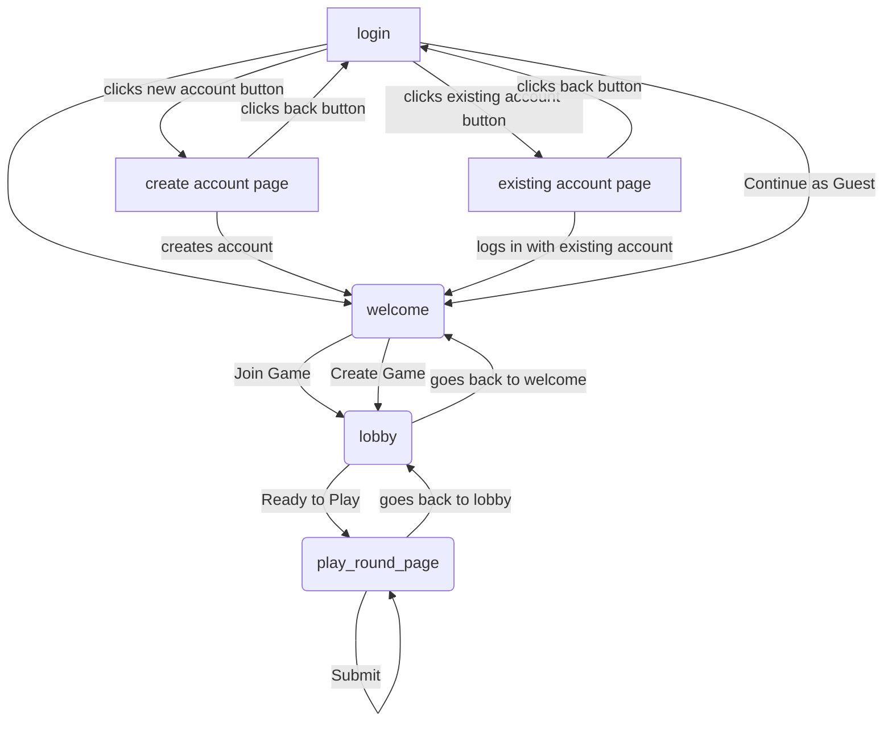

# WorstCaseScenario

## Flow diagram the different pages of webapp

```mermaid
flowchart TD;

A[login] -->|clicks new account button| B[create account page]
A -->|clicks existing account button| C[existing account page]
A --> D(welcome)
B -->|creates account| D
B -->|clicks back button| A
C -->|logs in with existing account| D
C -->|clicks back button| A
D -->|Join Game| E(lobby)
D -->|Create Game| E(lobby)
E -->|Ready to Play| G(play_round_page)
E -->|goes back to welcome| D
A -->|Continue as Guest| D(welcome)
G -->|Next Round| G
G -->|Submit| G
G -->|goes back to lobby| E
%% eventually we will want a way to finish the game
%% G -->|Finish game| F

```

How to run app:

cd into top level folder for repo, then
''
streamlit run app/main.py 
''