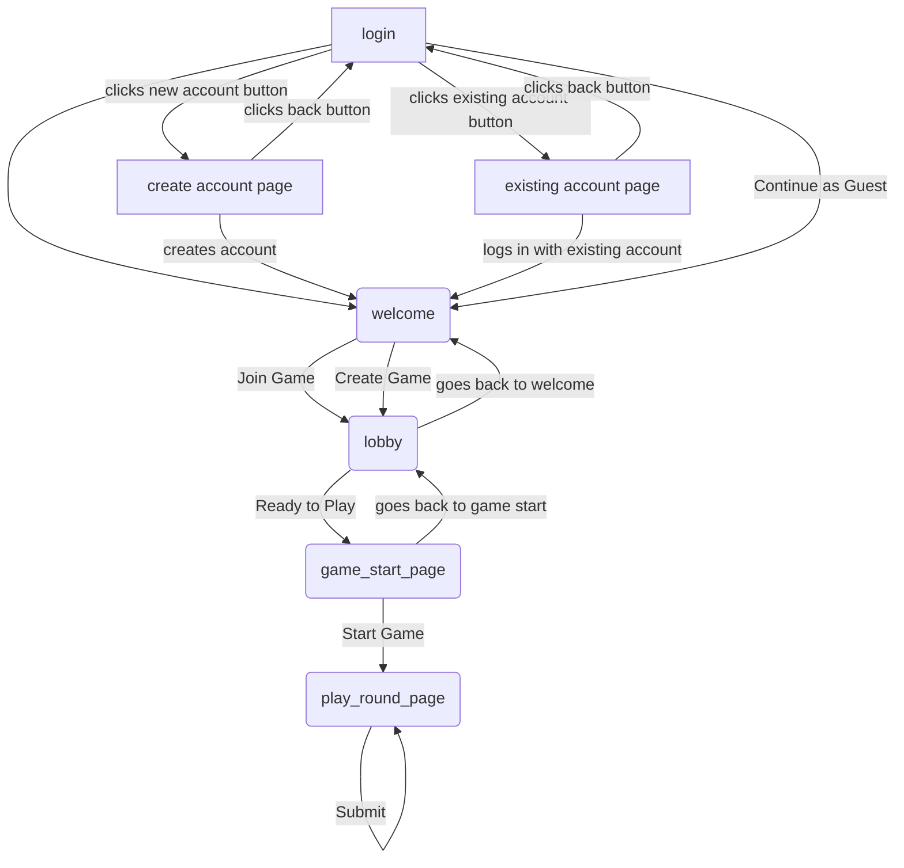

# WorstCaseScenario

## Flow diagram the different pages of webapp

tasks:
- getting a snowflake version of database to connect

- horizontal placement of buttons

-the database should have a column for round unique to game, should have a UUID column for game

- create logins where you can save users UUID so can calculate stats across rounds/games

- finding a "source" for scenarios that we can import to the rows.txt or whatever format

- come up with a set of examples, and then ask chatGPT to come up with many more examples
-> we can combine our results somehow at the end

- optional, the user can set a "theme" for the scenario's and then LLM/GPT can pick scenarios related to that theme

- in the scoring function, showing the results of your own ranking compared to the spymaster ranking - differences table

- we should have UUIDS associated with each scenario so we can do statistics at the end

- implement how users can vote on questions if they like or dislike them